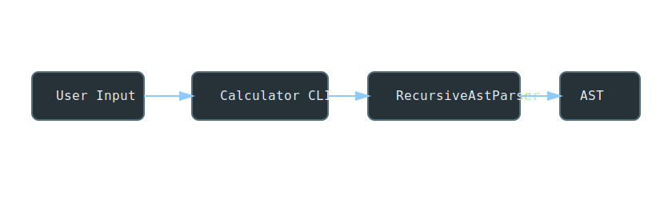
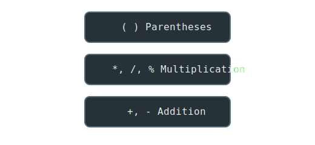
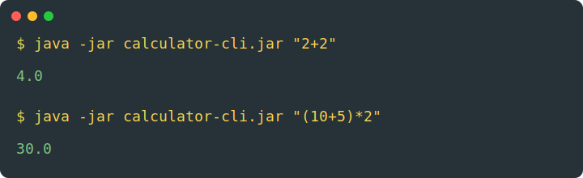
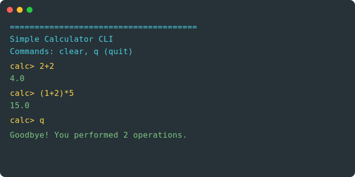
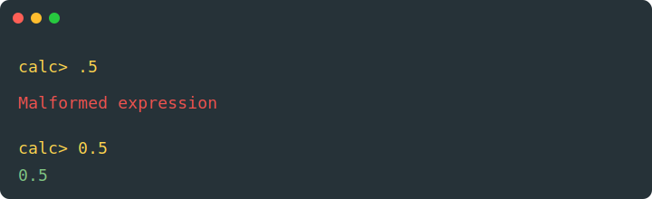
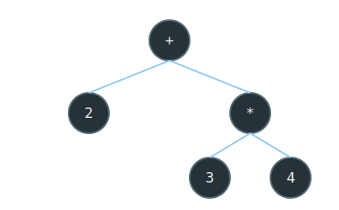

# Calculator CLI

A simple **command-line calculator written in Java**.

It evaluates mathematical expressions by delegating parsing and AST evaluation to the companion project:

➡ Core parser and AST engine:
[`calculator-api`](https://github.com/vmssilva/calculator-api)

This CLI acts as a **thin interactive interface** for the parser.

---

# Architecture



The CLI only handles:

* terminal interaction
* commands
* input handling

The actual parsing and evaluation are handled by the **calculator-api**.

---

# Features

* Interactive CLI mode
* Direct expression execution from arguments
* Colored terminal interface
* Expression parsing using an **AST**
* Automatic multiplication (`5(5+5)`)
* Signed numbers support
* Error detection for malformed expressions

---

# Supported Operations

| Operator | Description    |
| -------- | -------------- |
| `+`      | Addition       |
| `-`      | Subtraction    |
| `*`      | Multiplication |
| `/`      | Division       |
| `%`      | Modulo         |
| `( )`    | Parentheses    |

---

# Operator Precedence



---

# Dependency

This project depends on:
[`calculator-api`](https://github.com/vmssilva/calculator-api)

The dependency is responsible for:

* parsing expressions
* building the AST
* evaluating the result

---

# Running the Calculator

## Execute a single expression



Example:

```bash
java -jar calculator-cli.jar "2+2"
```

Output

```
4.0
```

---

# Interactive Mode

If no arguments are provided, the calculator starts in **interactive mode**.



Start the CLI:

```bash
java -jar calculator-cli.jar
```

Example session:

```
calc> 2+2
4.0

calc> (1+2)*5
15.0

calc> q
Goodbye! You performed 2 operations.
```

---

# Terminal Commands

| Command | Description          |
| ------- | -------------------- |
| `clear` | Clears the terminal  |
| `q`     | Exit the application |

Example:

```
calc> clear
```

---

# Expression Examples

## Numbers

```
calc> 1
1.0

calc> 1.5
1.5
```

---

## Signed Numbers

Explicit signs are supported.

```
calc> +1
1.0

calc> -1
-1.0
```

Also valid inside parentheses:

```
calc> (+1)
1.0

calc> (-1)
-1.0
```

---

# Implicit Multiplication

Expressions like:

```
5(5+5)
```

are automatically interpreted as:

```
5*(5+5)
```

Example:

```
calc> 5(5+5)
50.0
```

---

# Modulo Operator

```
calc> 10%3
1.0
```

Combined with parentheses:

```
calc> 5(10%3)
5.0
```

---

# Invalid Expressions

Numbers must include a **leading zero before decimals**.

Example:



Invalid:

```
calc> .5
Malformed expression
```

Correct:

```
calc> 0.5
0.5
```

---

# AST Example

Expression:

```
2 + 3 * 4
```

AST representation:



Evaluation order:

```
3 * 4 = 12
2 + 12 = 14
```

Result:

```
14
```

---

# 🚀 Quick Start

Build and run the **calculator-cli** from source.

The CLI depends on:

➡ calculator-api

Run the following commands:

```bash
# Clone the projects
git clone https://github.com/vmssilva/calculator-api.git
git clone https://github.com/vmssilva/calculator-cli.git

# Build and install the API
cd calculator-api
mvn clean install

# Build the CLI with dependencies
cd ../calculator-cli
mvn clean package

# Run the CLI
java -jar target/calculator-cli-1.0-SNAPSHOT.jar
```

---

## Optional Verification

You can verify that the API classes were bundled into the JAR:

```bash
jar tf target/calculator-cli-1.0-SNAPSHOT.jar | grep calculator/api
```

Expected output includes classes like:

```
com/github/vmssilva/calculator/api/parser/RecursiveAstParser.class
```

---

# License
This project is licensed under the **MIT License** – see the [LICENSE](LICENSE) file for details.
